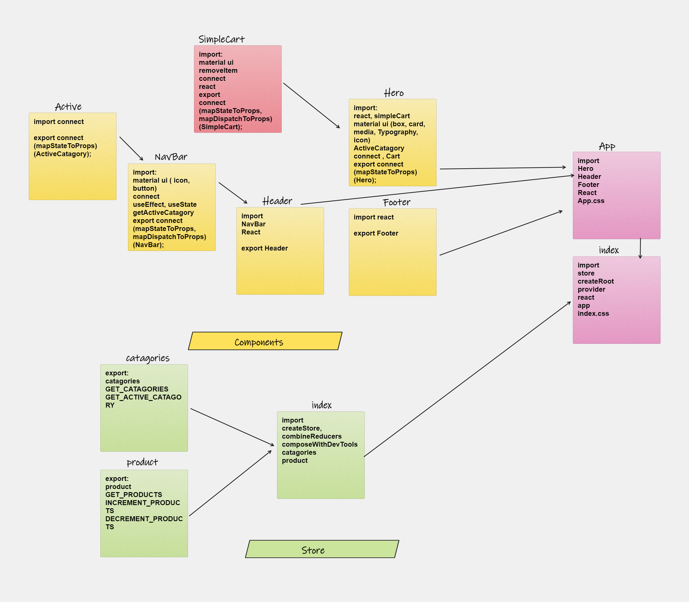

## Available Scripts

In the project directory, you can run:

### `npm start`

Runs the app in the development mode.\
Open [http://localhost:3000](http://localhost:3000) to view it in your browser.

### UML diagram

### Links:

[pull request](https://github.com/marah-jaradat/Store-Front/pull/6)

[deployment link](https://store-front-qhko9fiqg-marah-jaradat.vercel.app/)